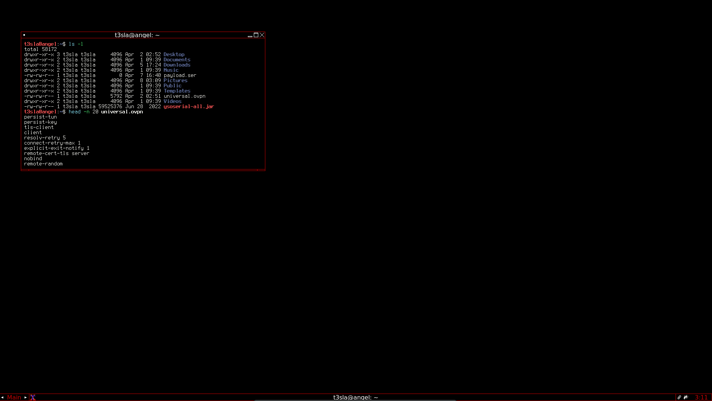
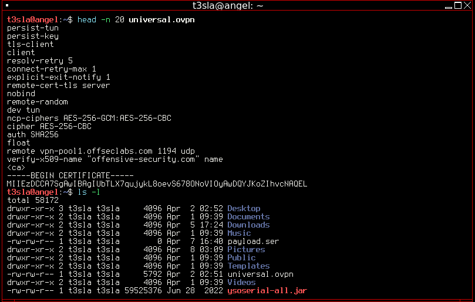
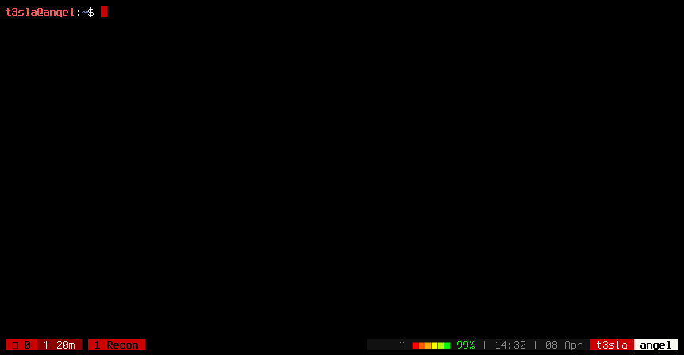
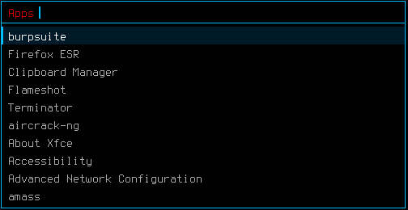
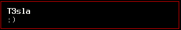

# BlackKali Dotfiles (Soon)

> A minimal, old-school hacker aesthetic inspired by **Kali Linux 1.x** and **BlackArch Fluxbox**.  
> Black backgrounds, red accents, Terminus font — built for focus.

```
  ██╗  ██╗ █████╗ ██╗     ██╗
  ██║ ██╔╝██╔══██╗██║     ██║
  █████╔╝ ███████║██║     ██║
  ██╔═██╗ ██╔══██║██║     ██║
  ██║  ██╗██║  ██║███████╗██║
  ╚═╝  ╚═╝╚═╝  ╚═╝╚══════╝╚═╝
         BlackKali Dotfiles
```

---

## Stack

| Component | Tool |
|-----------|------|
| Window Manager | Fluxbox 1.3.7 |
| Terminal | XTerm |
| Multiplexer | tmux + oh-my-tmux |
| Launcher | Rofi |
| Notifications | Dunst |
| Font | Terminus 12 |
| Shell | Bash |

---

## Palette

| Role | Hex | Preview |
|------|-----|---------|
| Background | `#000000` | ⬛ |
| Foreground | `#F8F8F2` | 🔳 |
| Accent / Borders | `#cc0000` | 🔴 |
| Prompt / Alerts | `#cc0000` | 🔴 |
| Inactive text | `#555555` | ⬜ |
| Selection | `#3a0000` | 🟥 |

---

## Structure

```
blackkali-dotfiles/
├── README.md
├── install.sh
├── fluxbox/
│   ├── init
│   ├── keys
│   ├── menu
│   ├── startup
│   └── styles/
│       └── blackkali
├── rofi/
│   ├── config.rasi
│   └── blackkali.rasi
├── dunst/
│   └── dunstrc
├── xterm/
│   └── .Xresources
└── tmux/
    └── .tmux.conf.local
```

---

## Install

### Fluxbox
```bash
mkdir -p ~/.fluxbox/styles
cp fluxbox/init ~/.fluxbox/init
cp fluxbox/keys ~/.fluxbox/keys
cp fluxbox/menu ~/.fluxbox/menu
cp fluxbox/startup ~/.fluxbox/startup
cp fluxbox/styles/blackkali ~/.fluxbox/styles/blackkali
chmod +x ~/.fluxbox/startup
```

### Rofi
```bash
mkdir -p ~/.config/rofi
cp rofi/config.rasi ~/.config/rofi/config.rasi
cp rofi/blackkali.rasi ~/.config/rofi/blackkali.rasi
```

### Dunst
```bash
mkdir -p ~/.config/dunst
cp dunst/dunstrc ~/.config/dunst/dunstrc
```

### XTerm
```bash
cp xterm/.Xresources ~/.Xresources
xrdb -merge ~/.Xresources
```

### tmux (oh-my-tmux)
```bash
cd ~
git clone https://github.com/gpakosz/.tmux.git
ln -s -f .tmux/.tmux.conf
cp tmux/.tmux.conf.local ~/.tmux.conf.local
```

---

## ⌨️ Keybindings (Fluxbox)

| Shortcut | Action |
|----------|--------|
| `Win + Enter` | Open XTerm |
| `Win + D` | Rofi launcher |
| `Win + Q` | Close window |
| `Win + Shift + Q` | Kill window |
| `Win + F` | Open Thunar |
| `Win + 1-9` | Switch workspace |
| `Win + Shift + 1-9` | Send window to workspace |
| `Alt + Tab` | Next window |

### XTerm
| Shortcut | Action |
|----------|--------|
| `Ctrl + Shift + C` | Copy |
| `Ctrl + Shift + V` | Paste |
| `Ctrl + Shift + =` | Increase font size |
| `Ctrl + -` | Decrease font size |
| `Ctrl + 0` | Reset font size |
| Middle click | Paste selection |

---

## Dependencies

```bash
sudo apt install -y \
  fluxbox \
  xterm \
  rofi \
  dunst \
  libnotify-bin \
  tmux \
  feh \
  thunar \
  fonts-terminus \
  xfonts-terminus \
  picom
```

---

## Recommended for Kali Linux

This theme is optimized for **Kali Linux 2026.x** running Fluxbox as the window manager alongside XFCE (both can coexist — select Fluxbox from LightDM at login).

---

## Screenshots








---

* Stay focused. 💀
